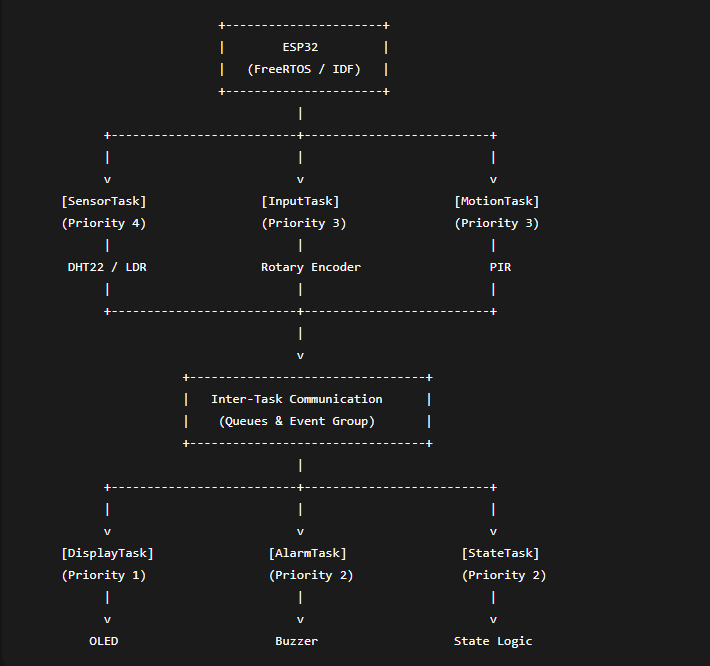
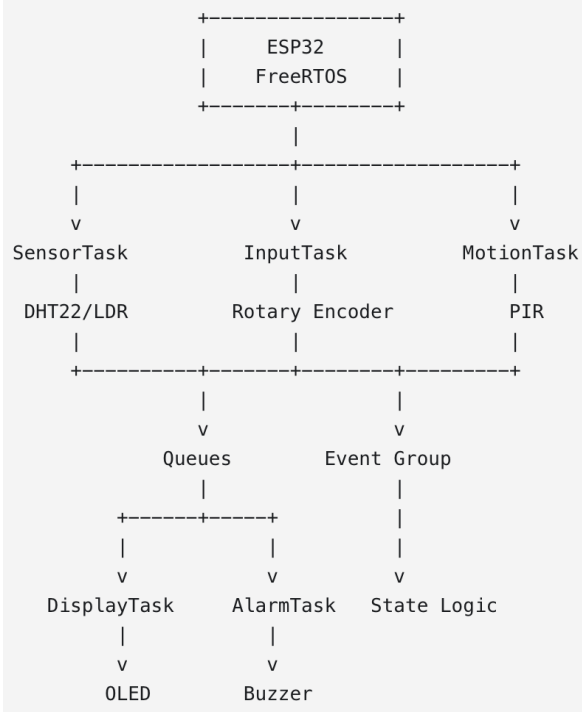

# BCA152 FreeRTOS Multisensor

A simulated ESP32 room-monitoring system built with FreeRTOS on the Espressif IoT Development
Framework (ESP-IDF), running entirely on the Wokwi simulator. The system reads temperature,
humidity, and ambient light; detects motion; displays a rotating set of readings on an OLED screen
navigated by a rotary encoder; and sounds a buzzer alarm when the temperature drifts outside a
configured safe range.


## Project Overview

I built this for my BCA152 Microcontrollers course at MSU-IIT as a hands-on exercise in concurrent
embedded systems design. Instead of writing one big loop the way a typical Arduino sketch would,
the firmware is split into six cooperating FreeRTOS tasks that talk to each other through queues and
a shared event group, each running at a priority chosen for how time-sensitive its job actually is.
Everything is simulated in Wokwi, so no physical hardware is needed to build, run, or verify it —
anyone can clone this repo and see it working in a browser.

## Features

- Periodic temperature and humidity sampling from a simulated DHT22 sensor
- Ambient light sensing through a photoresistor (LDR) on the ESP32's ADC
- PIR-based motion detection that drives an ACTIVE/INACTIVE system state machine
- Four-page OLED display (Temperature, Humidity, Light, Motion) navigated with a rotary encoder
- Buzzer alarm that turns on when temperature goes outside the configured safe range
- Automatic OLED power-down when the room has been inactive for a set timeout
- Thirteen unit tests covering the hardware-independent decision logic
- Static analysis via `cppcheck`, wired into the PlatformIO build

## Learning Objectives

- Design and implement a concurrent embedded system using FreeRTOS tasks, queues, mutexes,
  and event groups
- Interface multiple simulated sensors and actuators with an ESP32 through ESP-IDF's native
  driver APIs (GPIO, ADC, I2C, LEDC)
- Separate hardware-independent decision logic from hardware drivers so the logic can be unit
  tested on its own
- Justify task priorities based on scheduling urgency rather than how "important" a task feels
- Practice incremental, professional use of Git and GitHub

## System Architecture



`SensorTask` is the source of truth for sensor readings — it publishes a single `SensorData`
struct to two independent queues, one feeding `DisplayTask` and the other feeding `AlarmTask`.
Everything else that needs to be known system-wide (whether the room is ACTIVE, whether motion
was just seen, whether the alarm is currently firing) is broadcast through one shared FreeRTOS event
group, so no task needs a direct dependency on the internals of another.

## FreeRTOS Architecture



Six tasks run under the scheduler. `MotionTask` and `StateTask` set and clear bits on the shared
`systemEvents` event group; `DisplayTask`, `InputTask`, and `AlarmTask` all read that same event
group to decide how to behave. Three queues (`displayQueue`, `alarmQueue`, `modeQueue`) carry
actual data between tasks. Every queue and every event bit here has a real producer and at least one
real consumer in the code — none of them exist just to check a box.

## Hardware / Simulated Components

| Component | Purpose | ESP32 Pin |
|---|---|---|
| DHT22 | Temperature and humidity | GPIO15 (data) |
| Photoresistor (LDR) | Ambient light | GPIO34 (ADC1_CH6) |
| PIR motion sensor | Motion detection | GPIO26 |
| KY-040 rotary encoder | Page navigation | CLK: GPIO18, DT: GPIO19 |
| SSD1306 OLED (I2C) | Information display | SDA: GPIO21, SCL: GPIO22 |
| Buzzer (PWM via LEDC) | Alarm output | GPIO25 |

## Pin Configuration

All pins are defined once, in `include/config.h`, so nothing is hardcoded elsewhere:

```cpp
constexpr int PIN_DHT22    = 15;
constexpr int PIN_PIR      = 26;
constexpr int PIN_ENC_CLK  = 18;
constexpr int PIN_ENC_DT   = 19;
constexpr int PIN_OLED_SDA = 21;
constexpr int PIN_OLED_SCL = 22;
constexpr int PIN_BUZZER   = 25;
// LDR analog input: GPIO34 (ADC1_CHANNEL_6)
```

## Task Design

| Task | Responsibility | Period / Trigger | Priority |
|---|---|---|---|
| `SensorTask` | Reads DHT22 and LDR, publishes to both queues | 2 s (`vTaskDelayUntil`) | 2 |
| `DisplayTask` | Owns the OLED; renders the active page | Event-driven (queue + event bits) | 1 |
| `InputTask` | Polls the rotary encoder, advances the display page | 2 ms poll (`vTaskDelayUntil`) | 3 |
| `MotionTask` | Polls the PIR sensor, sets/clears `EVENT_MOTION` | 50 ms poll (`vTaskDelayUntil`) | 3 |
| `AlarmTask` | Evaluates temperature against safe limits, drives buzzer | Queue-driven, 200 ms timeout | 2 |
| `StateTask` | Centralizes ACTIVE/INACTIVE state management | 100 ms poll (`vTaskDelayUntil`) | 2 |

`MotionTask` and `InputTask` run at the highest priority (3) because both are polling fast-changing
digital signals — missing an encoder edge or reacting late to motion is immediately noticeable, and
both do a tiny, bounded amount of work per cycle, so running them first never starves anything else.
`SensorTask`, `AlarmTask`, and `StateTask` sit at priority 2: their correctness matters, but a couple
hundred milliseconds of scheduling delay is invisible against a 2-second sample interval or a
15-second inactivity timeout. `DisplayTask` is lowest (1) on purpose — an I2C OLED redraw is the
most expensive single operation in the system, and it's also the one users notice the least if it lags
by a frame, so it should never be allowed to hold up motion detection or encoder input.

## Inter-Task Communication

- **`displayQueue`** — `SensorData`, length 1. `SensorTask` → `DisplayTask`. Carries the latest
  temperature/humidity/light/motion reading so the OLED can render it.
- **`alarmQueue`** — `SensorData`, length 1. `SensorTask` → `AlarmTask`. Same data, separate
  queue, so a slow consumer on one side never blocks the other.
- **`modeQueue`** — `DisplayMode`, length 8. `InputTask` → `DisplayTask`. Carries encoder
  navigation events so the display knows which page to show next.
- **`systemEvents`** (event group) — three bits, described below, shared by every task that needs
  to know the room's current status without querying another task directly.

## State Machine

The system boots into `ACTIVE`. `StateTask` checks the `EVENT_MOTION` bit every 100 ms; if no
motion has been seen for `INACTIVITY_TIMEOUT_MS` (15 seconds), it clears `EVENT_ACTIVE` and the
system moves to `INACTIVE`. While `INACTIVE`, `DisplayTask` turns the OLED off and `AlarmTask`
suppresses the buzzer even if the temperature is technically out of range — motion detection itself
keeps running in the background, and the moment motion is seen again, the system snaps back to
`ACTIVE`.
```text
                    no motion for 15s
    ┌─────────────────────────────────────────┐
    │                                          ▼
┌────────┐                              ┌────────────┐
│ ACTIVE │                              │  INACTIVE  │
└────────┘                              └────────────┘
    ▲                                          │
    └──────────── motion detected ─────────────┘
```
    
**Event group bits:**

| Bit | Producer | Consumers | Set when | Cleared when |
|---|---|---|---|---|
| `EVENT_ACTIVE` | `StateTask` | `InputTask`, `AlarmTask`, `DisplayTask` | State becomes ACTIVE | State becomes INACTIVE |
| `EVENT_MOTION` | `MotionTask` | `StateTask` | PIR reads HIGH | PIR reads LOW |
| `EVENT_ALARM` | `AlarmTask` | `DisplayTask` | Temperature out of range | Temperature back to normal |

## Repository Structure
```text
bca152-freertos-multisensor/
├── include/          # Headers (one per subsystem)
├── src/              # Implementation files + main.cpp
├── test/             # Unit tests (native, hardware-independent)
├── docs/             # Laboratory report and images
├── platformio.ini    # esp32dev (ESP-IDF) + native (unit tests) environments
├── diagram.json      # Wokwi circuit definition
└── wokwi.toml        # Wokwi <-> PlatformIO build linkage
```
